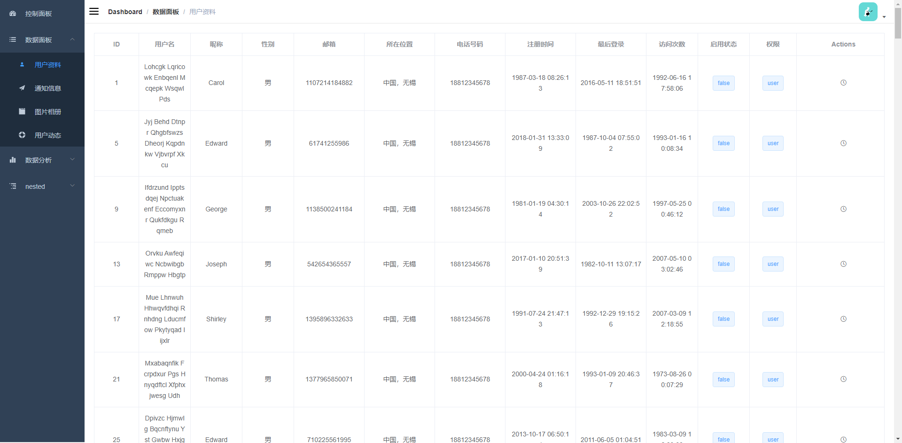
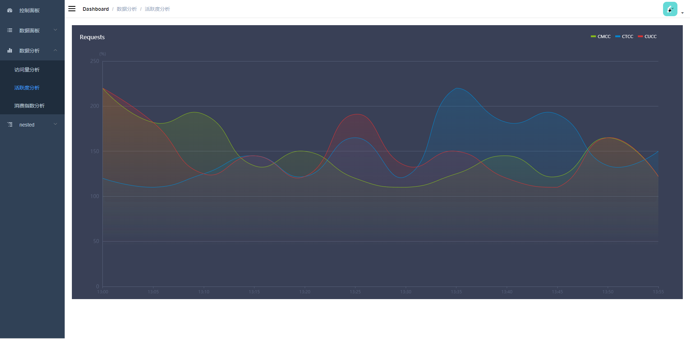

# lifecat-admin


 
:cat: :smiley_cat: :kissing_cat:

> 这是lifeCat项目的第三篇之一，一个简易的后台管理系统的前端vue项目，它使用了脚手架模板，可快速搭建模板项目。使用的UI框架为Element UI，使用axios调用API并使用mock进行数据的模拟，适合vue前端的学习。

#### [线上DEMO地址(仅部署前端)](http://www.lifecat.club/admin)

### 后续项目线上地址 (建议由浅入深的按顺序学习)

[lifecatweb的jsp+servlet项目](http://www.lifecat.club:8080/lifecatweb)

[lifecatweb的ssm后台管理系统项目](http://www.lifecat.club:8080/ssm)

[Vuejs+SpringBoot前后端分离仿ins图像网站(仅部署前端)](http://www.lifecat.club/lifecat)

## 脚手架模板使用

 [模板github地址](https://github.com/PanJiaChen/vue-element-admin)

## 项目部署
### 本地部署
``` bash
# Clone project
git clone https://github.com/kevinten10/Vue-Admin-lifecat.git

# Install dependencies
npm install

# 若报错，则根据异常信息安装相应的依赖包
npm install --save xxxxxx

# (可选)建议不要用cnpm  安装有各种诡异的bug 可以通过如下操作解决npm速度慢的问题
npm install --registry=https://registry.npm.taobao.org

# (运行)serve with hot reload at localhost:9527
npm run dev

---

# (打包)build for production with minification
npm run build

# (打包，可选)build for production and view the bundle analyzer report
npm run build --report
```

## DEMO





  
### lifecat相关项目
  [v1 jsp+servlet+mysql实现Javaweb](https://github.com/kevinten10/lifecatweb)    
  [v2 ssm框架实现Javaweb后台管理系统](https://github.com/kevinten10/SSM-lifecat)  
  [v3 前后端分离之SpringBoot实现Java后端开发](https://github.com/kevinten10/springboot-lifecat)  
  [v3 前后端分离之vue实现后台管理系统](https://github.com/kevinten10/Vue-Admin-lifecat)  
  [v3 前后端分离之vue实现仿ins效果web开发](https://github.com/kevinten10/Web-lifecat)  
  
  [ex wechat 微信移动端小程序开发](https://github.com/kevinten10/WeChat-lifecat)  
  [ex hadoop 分布式平台进行数据处理](https://github.com/kevinten10/Hadoop-lifecat)  
  [ex android 相应Android相册应用](https://github.com/kevinten10/Android-lifecat)  
  [ex python 机器学习进行图像智能处理](https://github.com/kevinten10/Python-lifecat)  
   
### LifeCat系列总览
  [LifeCat系列项目](https://github.com/kevinten10/LifeCat)  
  
  如果觉得有用，可以帮忙点个star，谢谢啦！
  
